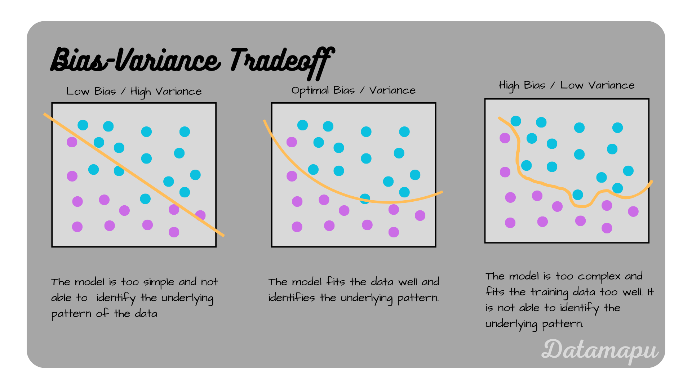

# Bias, Variance, and Noise

In Machine Learning, the overall predictive error of any model is mathematically decomposed into three distinct components: **Bias**, **Variance**, and **Noise**. Understanding how these three interact is the key to building models that generalize well to unseen data.

`Total Error = Bias² + Variance + Noise (Irreducible Error)`

---

## 1. Bias (Underfitting)

**Bias** is the error introduced by approximating a highly complex real-world problem with a much simpler model. It represents how far off the model's average prediction is from the actual true value.

- **Behavior:** A model with High Bias makes **very strong**, rigid assumptions about the data. It is not complex enough to capture the **underlying structure and patterns**. For example, trying to predict a curved trend with a **straight linear regression line**.
- **Result:** High Bias causes the model to **perform poorly** on both the training set and the test set. This phenomenon is known as **Underfitting**.

## 2. Variance (Overfitting)

**Variance** **represents** the model's **extreme sensitivity** to **small, random fluctuations** in **the training dataset**. It represents how much **the model's prediction** would change if you trained it on a **slightly different dataset**.

- **Behavior:** A model with **High Variance** is **overly complex** and flexible (e.g., an extremely deep Decision Tree). Instead of finding the general trend, it **memorizes the exact data points** provided to it, essentially "learning the noise."
- **Result:** High Variance causes the model to perform exceptionally well on the training data, but it fails to generalize, causing poor and erratic performance on the test data. This phenomenon is known as **Overfitting**.

// Image section

## 3. Noise (Irreducible Error)

**Noise** is the error introduced by the inherent randomness, ambiguity, or missing information within the data itself.

- **Behavior:** It represents variables that influence the target but weren't captured in the features, or **random measurement errors** during data collection.
- **Result:** Noise is an absolute baseline error that **cannot be reduced by any model**, no matter how advanced the algorithm or how much computation is used. It represents **the limit of prediction accuracy** for the given dataset.

---

## The Bias-Variance Tradeoff

The goal of any AI Engineer is to find the "sweet spot."

- If you make the model **too simple**, you suffer from **High Bias**.
- If you make the model **too complex**, you suffer from **High Variance**.

You must optimize model complexity, apply regularization, or tune hyperparameters to balance Bias and Variance, pushing the total error as close to the **Irreducible Noise** limit as possible.
